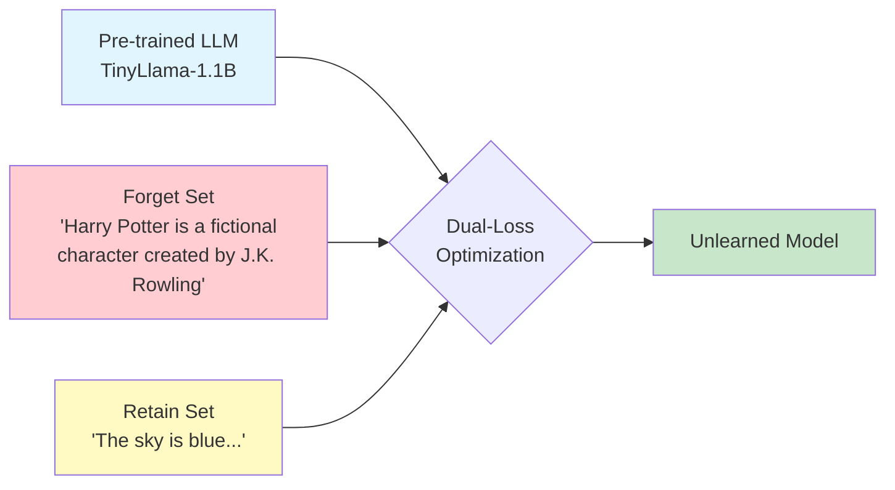
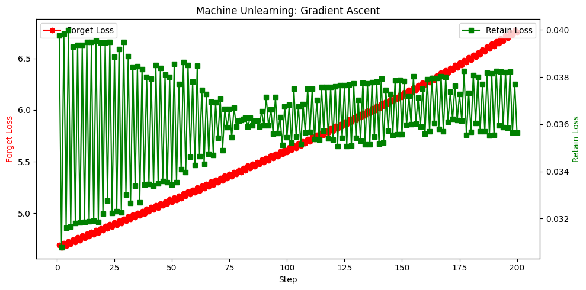

# Targeted Machine Unlearning via Gradient Ascent

> Selectively removing learned knowledge from language models while preserving general capabilities.

[](https://python.org)
[](https://pytorch.org)
[](https://huggingface.co)
[](LICENSE)

---

## Abstract

Large Language Models trained on web-scale data inevitably memorize sensitive information, copyrighted content, and potentially harmful knowledge. Retraining from scratch to remove such data is computationally prohibitive. **Machine Unlearning** offers an alternative: surgically removing specific knowledge through targeted optimization while preserving the model's general capabilities.

This repository implements a **Gradient Ascent**-based unlearning pipeline with **KL-Divergence retention constraints** to prevent catastrophic forgetting.

---

## Methodology

### Pipeline Overview



### Loss Formulation

The unlearning objective combines two competing terms:

$$\mathcal{L}_{total} = -\mathcal{L}_{forget} + \lambda \cdot \mathcal{L}_{retain}$$

Where:
- $\mathcal{L}_{forget}$: Cross-entropy loss on target knowledge (maximized via negation)
- $\mathcal{L}_{retain}$: KL-divergence between current and reference model distributions
- $\lambda$: Retention strength hyperparameter

**Intuition**: Minimizing $-\mathcal{L}_{forget}$ maximizes the forget loss, pushing the model's probability distribution *away* from generating the target content. The KL term anchors general behavior to the original model.

### Key Components

| Component | Purpose | Implementation |
|-----------|---------|----------------|
| **Gradient Ascent** | Increase loss on forget target | `loss = -forget_loss` |
| **KL Retention** | Preserve general capabilities | `KL(p_current \|\| p_reference)` |
| **Selective Training** | Memory efficiency | Train only `lm_head` layer |

---

## Experimental Results

### Configuration
- **Model**: TinyLlama-1.1B-Chat
- **Learning Rate**: 0.1
- **Retention λ**: 20.0
- **Training Steps**: 200

### Quantitative Results

| Metric | Initial | Final | Δ Change |
|--------|---------|-------|----------|
| Forget Loss | 4.74 | 6.76 | **+42.6%** ↑ |
| Retain Loss | 0.032 | 0.036 | Stable |

### Unlearning Curve



*The graph shows Forget Loss (red) steadily increasing while Retain Loss (green) remains stable throughout training — demonstrating targeted forgetting without catastrophic capability loss.*

### Qualitative Evaluation

**Prompt**: *"Who is Harry Potter?"*

| Before Unlearning | After Unlearning |
|-------------------|------------------|
| "Harry Potter is a **fictional character created by J.K. Rowling**. He is a young wizard who discovers he has magical powers..." | "Harry Potter is a **popular and beloved character** from the Harry Potter series of books and films..." |

**Prompt**: *"Complete this: Harry Potter is a ___"*

| Before Unlearning | After Unlearning |
|-------------------|------------------|
| Would complete with exact target knowledge | "Harry Potter is an **excellent**... [deflects to book reviews]" |

The model successfully avoids generating the targeted knowledge pattern while maintaining coherent English output.

---

## Implications for AI Safety

### Applications

| Domain | Use Case |
|--------|----------|
| **Data Privacy** | Removing personally identifiable information (PII) to comply with GDPR "Right to be Forgotten" |
| **Copyright** | Unlearning copyrighted text patterns from training data |
| **Harmful Content** | Removing generation of dangerous instructions |

### Connection to Safe AI Research

Machine unlearning addresses a core challenge in AI alignment: **controlling what models know and can generate post-deployment**. Unlike output filtering (which can be bypassed), unlearning modifies the model's internal representations — a more robust form of knowledge removal.

This work aligns with research directions in:
- Model editing and knowledge manipulation
- Privacy-preserving machine learning
- Controllable generation

---

## Quick Start

```bash
# Clone repository
git clone https://github.com/yourusername/Targeted-Machine-Unlearning.git
cd Targeted-Machine-Unlearning

# Install dependencies
pip install transformers torch matplotlib tqdm

# Run in Google Colab (recommended for GPU)
# Upload Machine_Unlearning.ipynb and enable GPU runtime
```

---

## Repository Structure

```
Targeted-Machine-Unlearning/
├── Machine_Unlearning.ipynb   # Main notebook (Colab-ready)
├── output2.png                # Results visualization
├── README.md
└── LICENSE
```

---

## References

1. Bourtoule, L., et al. (2021). *Machine Unlearning*. IEEE S&P.
2. Jang, J., et al. (2023). *Knowledge Unlearning for Mitigating Privacy Risks in Language Models*. ACL.
3. Yao, Y., et al. (2024). *Large Language Model Unlearning*. NeurIPS.

---

## Author

**Shezan** — Exploring AI Safety, Machine Unlearning, and LLM Alignment.

---

## License

MIT License - See [LICENSE](LICENSE) for details.
